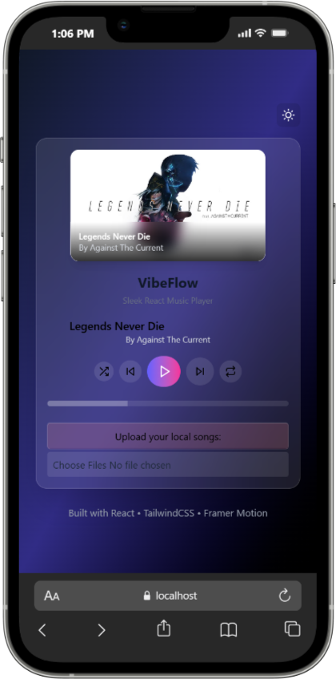
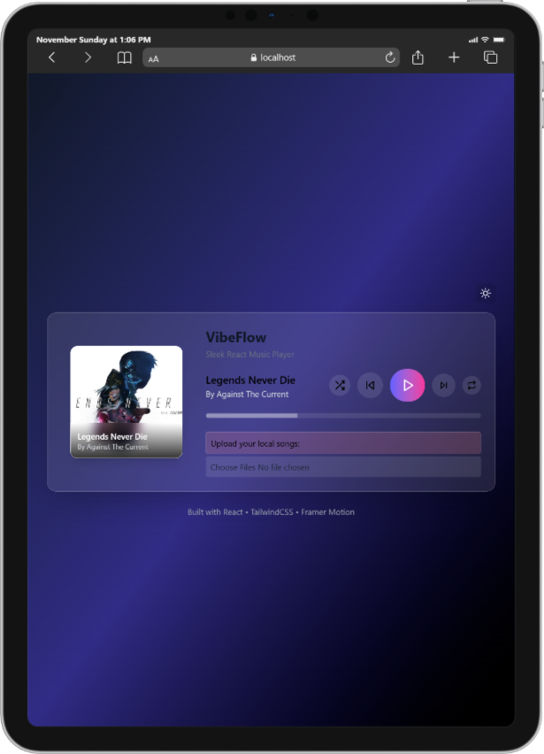
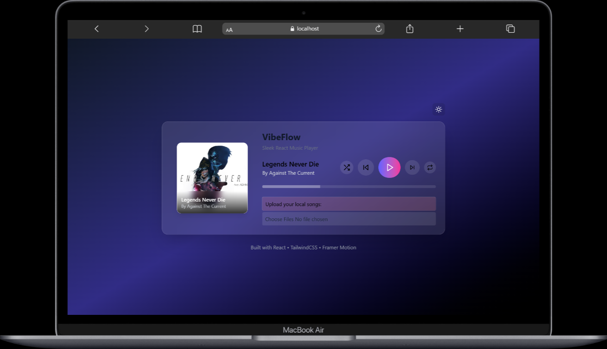

# 🎵 VibeFlow

A sleek, modern music player built with React and TailwindCSS. VibeFlow offers a beautiful, responsive interface for playing your favorite local music tracks with style.


## ✨ Features

- 🎨 Modern, minimalist UI with dark/light theme support
- 🎵 Local music file playback
- 🎼 Intuitive player controls (play, pause, next, previous)
- 📱 Fully responsive design
- 🌊 Smooth animations with Framer Motion
- 🎨 Beautiful song cards with cover art display
- 🎯 Real-time playback progress tracking

## 🚀 Tech Stack

- **Frontend Framework:** React 19
- **Styling:** TailwindCSS 4.1
- **Build Tool:** Vite 7
- **Animations:** Framer Motion
- **Icons:** React Icons
- **Code Quality:** ESLint

## 📦 Installation

1. Clone the repository:

```bash
git clone https://github.com/haseebjaved4212/VibeFlow.git
cd VibeFlow
```

2. Install dependencies:

```bash
npm install
```

3. Start the development server:

```bash
npm run dev
```

4. Open your browser and visit:

```
http://localhost:5173
```

## 🛠️ Available Scripts

- `npm run dev` - Start development server
- `npm run build` - Build for production
- `npm run preview` - Preview production build
- `npm run lint` - Lint code with ESLint

## 🎯 Usage

1. Launch the application
2. Click "Choose Files" to select your local music files
3. Your music library will appear as beautiful cards
4. Click on any song to start playing
5. Use the player controls at the bottom to:
   - Play/Pause
   - Skip to next/previous tracks
   - Toggle shuffle/repeat modes

## 🎨 Customization

The app uses TailwindCSS for styling. You can customize the appearance by:

- Modifying `tailwind.config.js` for theme customization
- Updating component styles in their respective `.jsx` files
- Adding new theme variations in the theme context

## 📱 Responsive Design

VibeFlow is designed to work beautifully across all devices:

### 📱 Mobile Experience


Perfect for on-the-go music playback with touch-optimized controls.

### 💻 Tablet View


Optimized layout for medium-sized screens with enhanced navigation.

### 🖥️ Desktop Experience


Full-featured music player with expanded controls and library view.

## 🤝 Contributing

1. Fork the repository
2. Create your feature branch (`git checkout -b feature/amazing-feature`)
3. Commit your changes (`git commit -m 'Add some amazing feature'`)
4. Push to the branch (`git push origin feature/amazing-feature`)
5. Open a Pull Request

## 📄 License

This project is open source and available under the [MIT License](LICENSE).

## 👨‍💻 Author

- **Haseeb Javed** - [GitHub Profile](https://github.com/haseebjaved4212)

## 🙏 Acknowledgments

- React team for the amazing framework
- TailwindCSS team for the utility-first CSS framework
- Framer Motion for smooth animations
- All contributors and users of VibeFlow

---

Made with ❤️ and React
